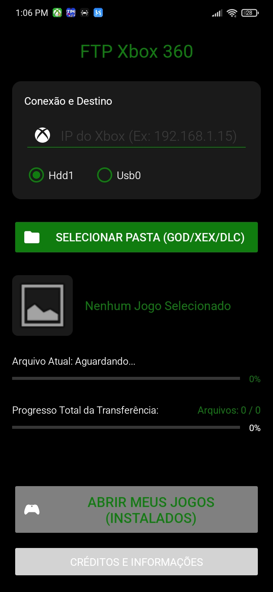
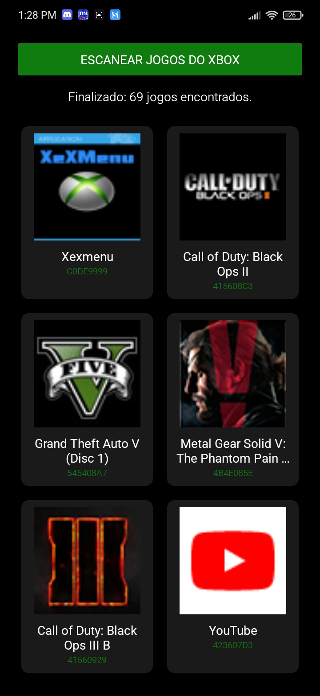
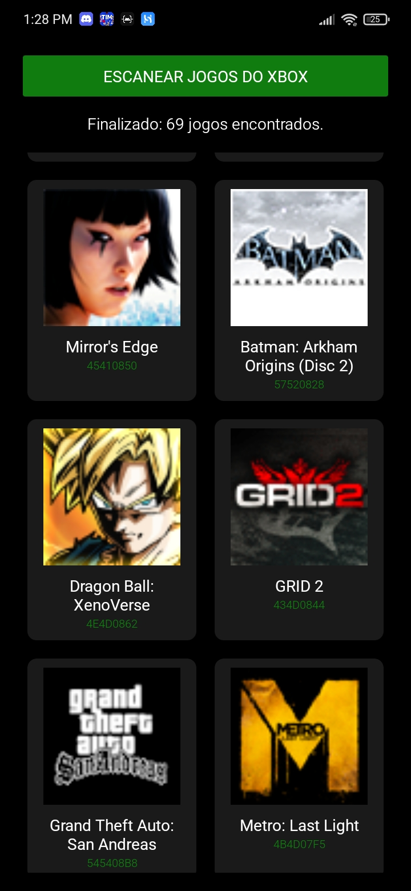
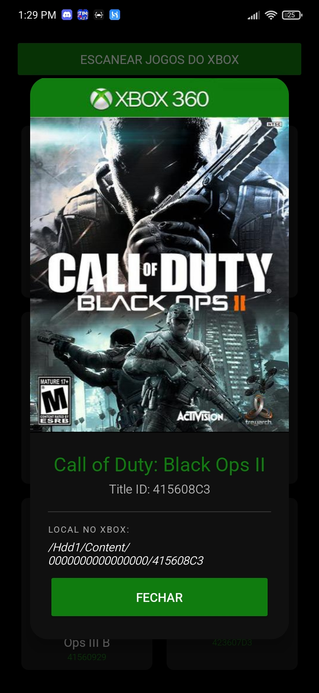
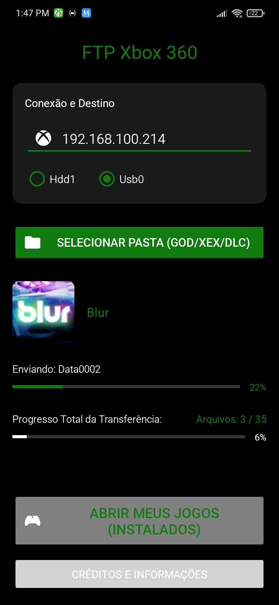

# XBOX FTP TRANSFER - Cliente FTP Android para Xbox 360 (RGH/JTAG) 🎮📱

Select your language / Selecione o seu idioma:
* 🇺🇸 [English](README.en.md)
* 🇪🇸 [Español](README.es.md)

*  [Releases](https://github.com/matheus7mhs/Xbox-FTP-Transfer/releases)
*  [ApkPure](https://apkpure.com/developer?id=1042847)
---

  <b>Gerencie e envie seus jogos e arquivos direto do celular para o Xbox 360!</b>

## ⚙️ Como o Xbox-FTP-Transfer funciona?

O **Xbox-FTP-Transfer** é o melhor aplicativo Android projetado para realizar transferências FTP robustas e diretas do seu celular para o **Xbox 360 (RGH/JTAG)**, otimizando a forma como você gerencia, instala jogos e transfere arquivos sem precisar de um PC ou pendrive.

Desenvolvido no AndroidIDE, o aplicativo vai muito além de um cliente FTP comum. Ele possui uma lógica inteligente focada especificamente na estrutura de arquivos do Xbox, sendo totalmente compatível com as dashboards **Aurora** e **XexMenu**.

## 📸 Screenshots do Aplicativo

  <b>Tela Inicial</b> 
  
    
  <b>Tela de Jogos Instalados</b> 
  
  
    
  <b>Informações de ID e Armazenamento</b> 
    
    
  <b>Tela de Transferência</b> 
  

### 🚀 Principais Funcionalidades

* **Organização Automática de Arquivos:** Envie jogos (formatos **GOD** e **XEX**), **DLCs** e arquivos em geral. O aplicativo identifica o conteúdo e o envia *automaticamente* para as pastas certas no seu Xbox 360 (como `Hdd1` ou `Usb0`).
* **Retomada de Transferência (Resume):** A internet caiu ou você precisou pausar? Não tem problema. O aplicativo possui suporte para continuar a transferência de arquivos exatamente de onde parou.
* **Compatibilidade Total:** Suporte para transferências utilizando o **Aurora** e o **XexMenu**.
* **Credenciais Customizáveis:** Acesse consoles com diferentes configurações de rede alterando livremente o **Usuário e a Senha** do FTP (o padrão costuma ser `xbox`, mas agora você tem total controle).
* **Inteligência de Metadados e Capas:** Identificação automática de **Title IDs**, busca recursiva por executáveis e download de capas dos jogos direto no celular através de um sistema de cache. Tenha sua biblioteca catalogada automaticamente!
* **Otimização do Console:** O aplicativo cria marcadores de identificação no armazenamento do Xbox, acelerando os escaneamentos futuros da sua dashboard.
* **Monitoramento em Tempo Real:** Acompanhe o progresso com notificações na tela do Android e avisos sonoros ao concluir as transferências.

### 🕹️ Como Usar:

1. Certifique-se de que o celular Android e o Xbox 360 estão conectados na **mesma rede Wi-Fi**.
2. Abra a dashboard (Aurora ou XexMenu) no seu Xbox 360 para que o servidor FTP do console fique ativo.
3. No aplicativo, insira o **IP local** do console e as credenciais de rede (**usuário e senha**).
4. Selecione a pasta do jogo (GOD ou XEX), DLC ou arquivo no armazenamento do seu Android.
5. Inicie a transferência! Acompanhe o progresso em tempo real e deixe que o sistema faça o roteamento para as pastas certas automaticamente.

---
### 📥 Download

*  [Releases do GitHub](https://github.com/matheus7mhs/Xbox-FTP-Transfer/releases)
*  [Baixar no ApkPure](https://apkpure.com/developer?id=1042847)

---

<b>🔍 Tags de Pesquisa (SEO)</b>

Xbox 360 FTP client, enviar jogos Xbox 360 pelo celular Android, transferir jogos Xbox RGH JTAG sem PC, FTP Android to Xbox 360, instalar DLC Xbox 360 celular, Aurora dashboard FTP transfer, XexMenu FTP, transfer Xbox 360 games via WiFi, Xbox-FTP-Transfer apk.

