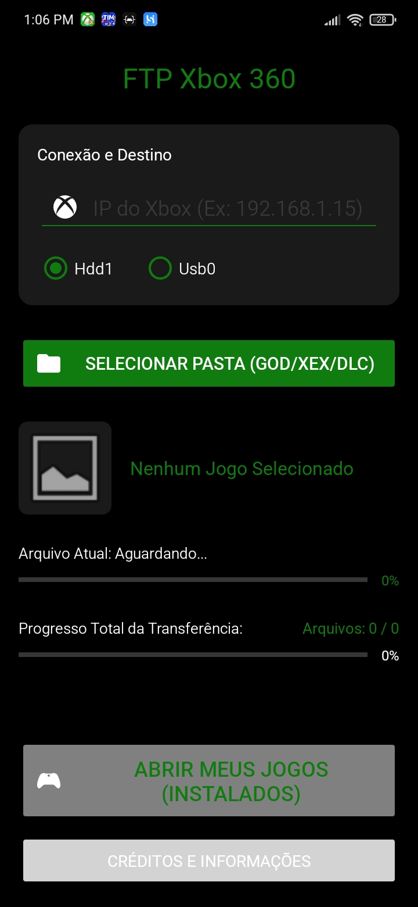
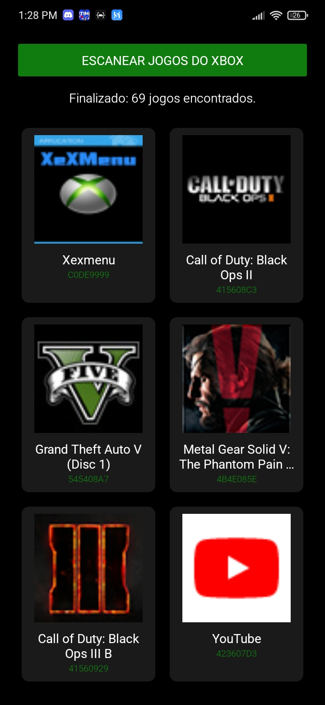
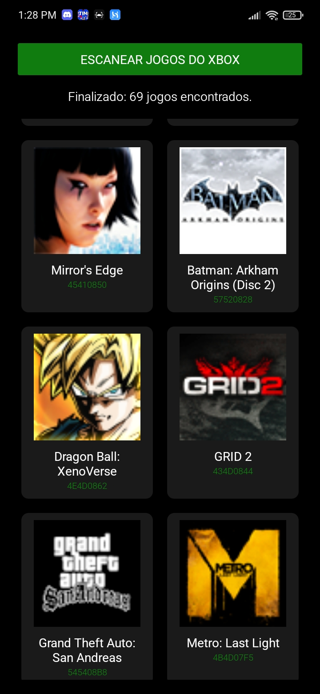
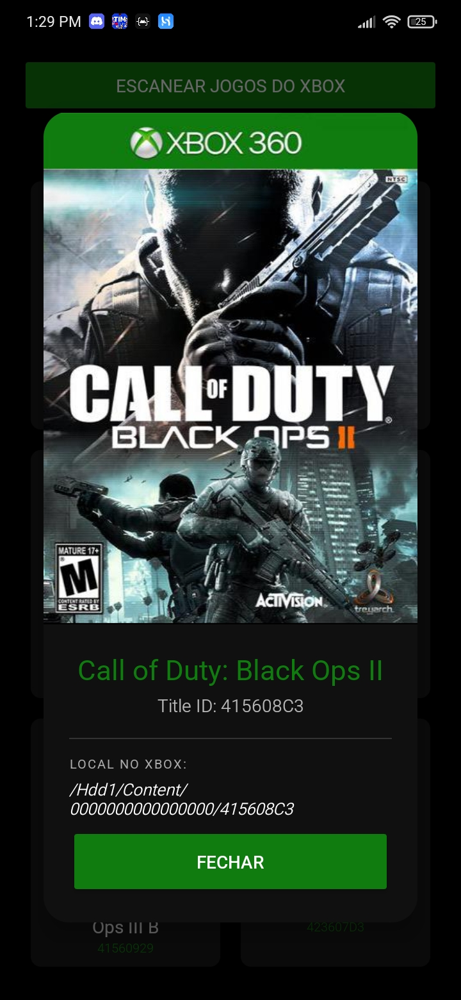
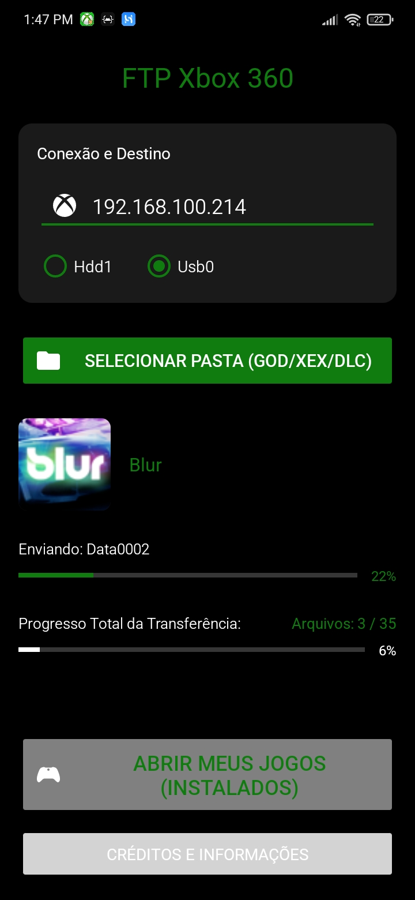

<!--
# Xbox FTP Transfer 9.1

Aplicativo Android para transferir, organizar e gerenciar jogos em consoles **Xbox 360 RGH/JTAG** por FTP, usando a rede local. O projeto foi desenvolvido em Java/XML para facilitar o uso pelo celular, sem precisar remover o armazenamento do console.

> **Atenção:** este aplicativo não é um cliente USB OTG. A comunicação com o Xbox 360 é feita por FTP através da rede local. O Xbox precisa estar ligado, com um servidor FTP ativo — por exemplo, pelo Aurora, XeXMenu ou outra solução compatível.

## Sobre o projeto

O Xbox FTP Transfer simplifica tarefas que normalmente exigem um computador:

- enviar jogos para o HD interno ou dispositivos USB conectados ao Xbox;
- reconhecer automaticamente jogos XEX, GOD e XBLA;
- acompanhar o progresso de arquivos grandes;
- continuar o envio mesmo quando o aplicativo é minimizado;
- consultar a biblioteca instalada no Xbox;
- visualizar Title ID, nome, capa, localização e tamanho dos jogos;
- consultar DLCs, saves e Title Updates;
- remover jogos e conteúdos diretamente pelo FTP.

## Principais recursos

### Transferência de jogos

- Conexão FTP configurável por IP, usuário, senha e porta.
- Suporte aos destinos `Hdd1`, `Usb0` e `Usb1`, quando disponíveis.
- Seleção da pasta de origem usando o seletor oficial de documentos do Android.
- Detecção de conteúdo XEX através do arquivo `default.xex`.
- Instalação de conteúdo XEX em `Games` ou `Apps`.
- Transferência de jogos GOD/STFS para a estrutura correta de `Content`.
- Verificação do tamanho remoto antes do envio.
- Arquivos que já possuem o mesmo tamanho podem ser ignorados, reduzindo o tempo de transferência.
- Substituição de arquivos incompletos ou com tamanho diferente.

### Fila e execução em segundo plano

- Fila para enviar vários jogos em sequência.
- Foreground Service do Android para manter a transferência ativa em segundo plano.
- Notificação persistente com progresso total.
- Progresso do arquivo atual e da transferência completa.
- Pausar e retomar o envio.
- Cancelar o arquivo atual e limpar a fila pendente.
- Reconexão automática em caso de instabilidade da rede.
- Até 60 tentativas consecutivas antes de informar falha definitiva.

### Reinício remoto do Aurora

Quando a conexão falha repetidamente, o aplicativo pode detectar que o Aurora provavelmente parou de responder e oferecer um reinício remoto.

O usuário pode escolher:

- reiniciar o Aurora uma única vez;
- ativar o reinício automático em falhas futuras;
- recusar o reinício.

A comunicação com a interface web do Aurora é feita por uma `WebView`. Após o reinício, o aplicativo aguarda o console voltar a responder e tenta continuar o envio.

### Biblioteca de jogos

A tela **Meus Jogos** escaneia os armazenamentos do Xbox:

- `Hdd1`;
- `Usb0`;
- `Usb1`;
- `Usb2`.

O catálogo identifica:

- jogos GOD em `00007000`;
- jogos XBLA/Arcade em `000D0000` e `000D0001`;
- jogos XEX em pastas contendo `default.xex`.

A biblioteca exibe:

- nome do jogo;
- Title ID;
- tipo do jogo;
- caminho no Xbox;
- capa;
- tamanho total;
- DLCs;
- saves;
- Title Updates.

O resultado do escaneamento é salvo em cache por endereço IP para permitir uma abertura mais rápida da biblioteca.

### Gerenciamento remoto

Pelo diálogo de detalhes é possível:

- consultar a localização do jogo;
- calcular o tamanho total do jogo e conteúdos associados;
- listar DLC, saves e Title Updates;
- remover apenas o jogo;
- remover o jogo junto com DLC, saves e Title Updates.

A exclusão é permanente no armazenamento do Xbox e deve ser usada com cuidado.

### Capas e nomes

- Identificação de jogos por Title ID.
- Banco local `jogos.csv` para converter Title IDs conhecidos em nomes.
- Cache local de capas para reduzir downloads repetidos.
- Redução da resolução das imagens antes de carregá-las na memória.
- Compatibilidade com múltiplos idiomas.

## Novidades da versão 9.1

A versão 9.1 representa uma evolução significativa em relação à versão anterior, que tinha como foco principal a conexão FTP e o envio básico de arquivos.

### 1. Serviço de transferência dedicado

A transferência foi separada da tela principal em `TransferService`. Isso permite:

- manter o envio ativo com o aplicativo minimizado;
- exibir notificação de progresso;
- separar a interface da lógica de rede;
- reconectar sem depender diretamente do ciclo de vida da Activity.

### 2. Fila de múltiplos jogos

Nas versões anteriores, o fluxo era mais limitado a uma transferência por vez. A 9.1 adiciona uma fila que recebe vários jogos e envia cada um automaticamente após a conclusão do anterior.

### 3. Pausar, retomar e cancelar

Foram adicionados controles para:

- pausar a leitura do arquivo atual;
- retomar o envio de onde estava;
- cancelar a transferência em andamento;
- limpar os jogos que ainda estavam aguardando na fila.

### 4. Reconexão automática mais resistente

O envio passou a lidar melhor com redes Wi-Fi instáveis e quedas de conexão do Xbox. O aplicativo:

- mantém o índice do arquivo/tarefa atual;
- reconecta ao servidor FTP;
- continua a partir da tarefa que falhou;
- limita o número de tentativas;
- exibe o contador de reconexões na interface.

### 5. Reinício remoto do Aurora

A 9.1 adiciona a possibilidade de reiniciar o Aurora remotamente quando ele deixa de responder durante uma transferência. O usuário pode autorizar a ação manualmente ou ativar o modo automático.

### 6. Verificação inteligente de arquivos

Antes de enviar um arquivo, o aplicativo consulta o tamanho existente no Xbox. Se o tamanho remoto for igual ao tamanho local, o envio é ignorado. Isso evita transferências desnecessárias depois de uma interrupção ou ao repetir uma operação.

### 7. Suporte ampliado a GOD, XEX e XBLA

O reconhecimento deixou de se concentrar apenas em pastas XEX. A biblioteca agora diferencia:

- XEX;
- GOD;
- XBLA/Arcade;
- pacotes STFS com cabeçalhos `CON `, `PIRS` e `LIVE`.

Também foi incluída leitura de cabeçalho STFS por FTP para catalogar jogos XBLA sem precisar baixar o pacote inteiro para o celular.

### 8. Nova biblioteca de jogos instalada

Foi adicionada uma tela dedicada para escanear os jogos instalados no Xbox. Ela usa `GameDatabase`, `GameCache`, `GameAdapter` e `MeusJogosFragment` para montar uma biblioteca navegável.

### 9. Cálculo de tamanho e conteúdos extras

A versão 9.1 passou a calcular separadamente:

- tamanho do jogo principal;
- DLC;
- saves públicos e de perfis;
- Title Updates.

Também permite listar esses conteúdos antes de uma eventual desinstalação.

### 10. Desinstalação remota

Foi adicionado o gerenciamento de exclusão via FTP, com duas opções:

- remover somente o jogo;
- remover o jogo, DLC, saves e Title Updates.

### 11. Cache de catálogo e imagens

A biblioteca salva o resultado do escaneamento por IP e mantém capas em cache. Isso diminui o tempo de abertura e reduz a quantidade de requisições à rede.

### 12. Interface e internacionalização

A interface foi ampliada com:

- tela de biblioteca;
- diálogos de detalhes;
- configuração FTP e Aurora;
- tutorial inicial;
- créditos;
- botões de pausa, retomada e cancelamento;
- layouts responsivos para telas maiores;
- suporte a vários idiomas;
- tema claro/escuro.

### 13. Atualização da base Android

O projeto atual utiliza:

- Android Gradle Plugin 8.11.0;
- Gradle 8.13;
- Java 17;
- `compileSdk 36`;
- `targetSdk 36`;
- `minSdk 24`;
- View Binding;
- AndroidX DocumentFile, RecyclerView, CardView e Material Components.

## Comparação resumida

| Área | Versões anteriores | Xbox FTP Transfer 9.1 |
|---|---|---|
| Transferência | Envio FTP básico | Serviço dedicado com fila e foreground service |
| Jogos | Fluxo mais simples | XEX, GOD, STFS e XBLA |
| Execução | Mais dependente da tela aberta | Continua em segundo plano com notificação |
| Falhas de rede | Recuperação limitada | Reconexão automática com limite de tentativas |
| Controle | Início da transferência | Iniciar, pausar, retomar e cancelar |
| Arquivos repetidos | Reenvio possível | Verificação de tamanho remoto |
| Aurora | Sem automação integrada | Reinício remoto opcional |
| Biblioteca | Não disponível ou limitada | Catálogo remoto de jogos instalados |
| Identificação | Nome da pasta/arquivo | Title ID, banco local e cabeçalho STFS/XEX |
| XBLA | Não catalogado de forma dedicada | Detecção em `000D0000` e `000D0001` |
| Conteúdo extra | Não detalhado | DLC, saves e Title Updates |
| Desinstalação | Não disponível | Remoção do jogo ou dos extras por FTP |
| Cache | Limitado | Cache de catálogo por IP e cache de capas |
| Interface | Tela de transferência | Transferência, biblioteca, detalhes, configurações e tutorial |
| Idiomas | Mais limitado | Vários arquivos de tradução incluídos |

## Requisitos

### No Xbox 360

- Xbox 360 com RGH/JTAG ou configuração compatível;
- Aurora, XeXMenu ou outro servidor FTP ativo;
- IP acessível pela rede local;
- usuário, senha e porta FTP configurados;
- espaço livre no destino escolhido.

### No Android

- Android 7.0 ou superior, devido ao `minSdk 24`;
- conexão na mesma rede do Xbox;
- permissão para notificações no Android 13 ou superior;
- desativação da otimização de bateria para o aplicativo, recomendada para transferências longas.

## Como usar

1. Abra o servidor FTP no Xbox.
2. Anote o IP exibido pelo Aurora ou XeXMenu.
3. Abra o Xbox FTP Transfer.
4. Informe o IP do Xbox.
5. Toque em **Testar Conexão**.
6. Configure usuário, senha e porta, se forem diferentes do padrão.
7. Escolha `Hdd1`, `Usb0` ou `Usb1`.
8. Toque em **Selecionar Pasta**.
9. Escolha a pasta raiz do jogo no armazenamento do Android.
10. Se for XEX, escolha o destino `Games` ou `Apps`.
11. Acompanhe o envio pela tela ou pela notificação.
12. Para consultar jogos instalados, abra **Meus Jogos** e toque em **Escanear Xbox**.

## Compilação no Android Studio

O projeto é um projeto Android Gradle com módulo `app`.

### Pré-requisitos

- Android Studio atualizado;
- JDK 17;
- Android SDK Platform 36;
- Build-Tools compatível;
- acesso à internet para baixar dependências Gradle.

### Abrir o projeto

1. Extraia o projeto.
2. Abra no Android Studio a pasta que contém `settings.gradle`.
3. Não abra somente a pasta `app`.
4. Configure o Gradle para utilizar JDK 17.
5. Instale a API 36 pelo SDK Manager.
6. Sincronize o projeto.
7. Execute **Build > Make Project**.

Comando pelo terminal:

```bash
chmod +x gradlew
./gradlew :app:assembleDebug
```

O APK de debug será criado em:

```text
app/build/outputs/apk/debug/app-debug.apk
```

## Segurança e limitações

- FTP e HTTP podem transmitir credenciais sem criptografia, dependendo da configuração do Xbox e do Aurora.
- As credenciais são salvas nas preferências do aplicativo e devem ser protegidas em futuras versões.
- A opção de reinício remoto depende da estrutura HTML e da API web do Aurora.
- A fila atual fica em memória; se o Android encerrar o processo, a fila pode ser perdida.
- A desinstalação remove arquivos permanentemente do Xbox.
- Capas e nomes podem depender de serviços externos.
- O projeto deve ser testado com uma cópia de segurança antes de utilizar a exclusão remota.

## Estado do projeto

- **Versão do aplicativo:** 9.1
- **Código da versão:** 9
- **Plataforma:** Android
- **Linguagem:** Java/XML
- **Licença:** defina a licença antes de publicar o repositório
- **Status:** desenvolvimento/uso experimental

O ZIP recebido possui o nome `meuXboxin_10.3.zip`, mas o Gradle declara `versionName "9.1"` e `versionCode 9`. Recomenda-se alinhar o nome do arquivo, a versão do Gradle, o changelog e as tags do Git antes da publicação.

## Contribuição

Contribuições são bem-vindas. Antes de abrir um pull request:

1. teste a conexão com um Xbox real;
2. valide transferências XEX, GOD e XBLA;
3. teste rede instável;
4. teste pausa, retomada e cancelamento;
5. não inclua `local.properties`, APKs, senhas ou dados pessoais;
6. documente qualquer alteração no protocolo FTP ou no comportamento do Aurora.

## Créditos

- **Desenvolvedor:** Matheus Andrade
- **Banco de IDs e ícones:** XboxUnity.net
- **Banco de capas:** Archive.org
- **Ferramentas de apoio:** Gemini AI e Claude
- **Ambiente de desenvolvimento original:** AndroidIDE/Code On The Go
-->
# XBOX FTP TRANSFER - Cliente FTP Android para Xbox 360 (RGH/JTAG/Exploit) 🎮📱

Select your language / Selecione o seu idioma:
* 🇺🇸 [English](README.en.md)
* 🇪🇸 [Español](README.es.md)
* 🇫🇷 [Français](README.fr.md) 

*  [Releases](https://github.com/matheus7mhs/Xbox-FTP-Transfer/releases)

---

<p align="center">
  <b>Gerencie e envie seus jogos e arquivos direto do celular para o Xbox 360!</b>
</p>

## ⚙️ Como o Xbox-FTP-Transfer funciona?

O **Xbox-FTP-Transfer** é o melhor aplicativo Android projetado para realizar transferências FTP robustas e diretas do seu celular para o **Xbox 360 (RGH/JTAG/Exploit)**, otimizando a forma como você gerencia, instala jogos e transfere arquivos sem precisar de um PC ou pendrive.

Desenvolvido no AndroidIDE, o aplicativo vai muito além de um cliente FTP comum. Ele possui uma lógica inteligente focada especificamente na estrutura de arquivos do Xbox, sendo totalmente compatível com as dashboards **Aurora** e **XexMenu**.

## 📸 Screenshots do Aplicativo
<p align="center">
  <b>Tela Inicial</b><br>
  
  <br><br>
  <b>Tela de Jogos Instalados</b><br>
  
  
  <br><br>
  <b>Informações de ID e Armazenamento</b><br>
    
  <br><br>
  <b>Tela de Transferência</b><br>
  
</p>

### 🚀 Principais Funcionalidades

* **Organização Automática de Arquivos:** Envie jogos (formatos **GOD** e **XEX**), **DLCs** e arquivos em geral. O aplicativo identifica o conteúdo e o envia *automaticamente* para as pastas certas no seu Xbox 360 (como `Hdd1` ou `Usb0`).
* **Retomada de Transferência (Resume):** A internet caiu ou você precisou pausar? Não tem problema. O aplicativo possui suporte para continuar a transferência de arquivos exatamente de onde parou.
* **Compatibilidade Total:** Suporte para transferências utilizando o **Aurora** e o **XexMenu**.
* **Credenciais Customizáveis:** Acesse consoles com diferentes configurações de rede alterando livremente o **Usuário e a Senha** do FTP (o padrão costuma ser `xbox`, mas agora você tem total controle).
* **Inteligência de Metadados e Capas:** Identificação automática de **Title IDs**, busca recursiva por executáveis e download de capas dos jogos direto no celular através de um sistema de cache. Tenha sua biblioteca catalogada automaticamente!
* **Otimização do Console:** O aplicativo cria marcadores de identificação no armazenamento do Xbox, acelerando os escaneamentos futuros da sua dashboard.
* **Monitoramento em Tempo Real:** Acompanhe o progresso com notificações na tela do Android e avisos sonoros ao concluir as transferências.

### 🕹️ Como Usar:

1. Certifique-se de que o celular Android e o Xbox 360 estão conectados na **mesma rede Wi-Fi**.
2. Abra a dashboard (Aurora ou XexMenu) no seu Xbox 360 para que o servidor FTP do console fique ativo.
3. No aplicativo, insira o **IP local** do console e as credenciais de rede (**usuário e senha**).
4. Selecione a pasta do jogo (GOD ou XEX), DLC ou arquivo no armazenamento do seu Android.
5. Inicie a transferência! Acompanhe o progresso em tempo real e deixe que o sistema faça o roteamento para as pastas certas automaticamente.
---
Prefere transferir jogos por USB? Confira o **[My 360 Storage](https://github.com/matheus7mhs/My-360-Storage)**-um app alternativo que usa o USB do celular!
*  [Alternativa USB](https://github.com/matheus7mhs/My-360-Storage)
---
### 📥 Download

*  [Releases do GitHub](https://github.com/matheus7mhs/Xbox-FTP-Transfer/releases)

---
<details>
<summary><b>🔍 Tags de Pesquisa (SEO)</b></summary>
<p>Xbox 360 FTP client, enviar jogos Xbox 360 pelo celular Android, transferir jogos Xbox RGH JTAG sem PC, FTP Android to Xbox 360, instalar DLC Xbox 360 celular, Aurora dashboard FTP transfer, XexMenu FTP, transfer Xbox 360 games via WiFi, Xbox FTP Transfer apk, transferir jogos celular para xbox 360 aurora,How to transfer RGH Xbox 360 games using a smartphone without a PC, apkpure, Xbox FTP Transfer no apkpure.</p>
</details>
<!--
================================================================================
SEO & SEARCH ENGINE OPTIMIZATION METADATA
Languages: English (EN), Português (PT-BR), Español (ES), Français (FR)
Target Systems: Google Search, GitHub Search, YouTube Search, Crawlers & Indexers
================================================================================

--- GLOBAL & ENGLISH SEARCH TERMS ---
Xbox 360, Xbox 360 RGH, Xbox 360 JTAG, Android Xbox 360 transfer, Xbox 360 FTP client,
Xbox FTP Transfer, My 360 Storage, GOD format, XBLA format, XEX format, Xbox 360 Title ID,
Xbox 360 Aurora Dashboard, Freestyle Dash 3, FSD3, Xbox 360 homebrew, Xbox 360 game manager,
how to transfer games to Xbox 360 from phone, send Xbox 360 games without PC, Xbox 360 Android OTG, Exploit xbox 360,
Xbox 360 DLC installer, Xbox 360 save transfer, Xbox 360 title updates, smartphone Xbox 360 FTP,
AndroidIDE Xbox project, Xbox 360 wireless game transfer, transfer games phone to Xbox 360,
Xbox 360 file manager Android, RGH JTAG FTP app, Xbox 360 covers download, Exploit, Xbox 360 USB manager.

--- PORTUGUÊS BRASILEIRO (PT-BR) ---
como passar jogos de Xbox 360 pelo celular, transferir jogos celular para Xbox 360 Aurora,
enviar jogos para Xbox 360 via FTP pelo celular, passar jogos Xbox 360 sem PC,
gerenciador de jogos Xbox 360 Android, como colocar jogos no Xbox 360 com o celular,
passar jogo GOD XEX Xbox 360 celular, tutorial FTP Xbox 360 Android RGH JTAG,
como conectar celular no Xbox 360 RGH, passar capa de jogo Xbox 360 pelo celular,
gerenciador de arquivos Xbox 360 via rede, aplicativo FTP Xbox 360 celular,
transferir DLC Xbox 360 celular, atualizar jogos Xbox 360 pelo celular, pen drive Xbox 360 OTG.

--- ESPAÑOL (ES) ---
cómo pasar juegos a Xbox 360 desde el móvil, transferir juegos celular a Xbox 360 RGH sin PC,
enviar juegos a Xbox 360 por FTP con celular, gestor de juegos Xbox 360 Android,
cómo instalar juegos GOD y XEX en Xbox 360 con el teléfono, tutorial FTP Xbox 360 Aurora,
cómo poner juegos en Xbox 360 RGH JTAG desde el móvil, administrador de archivos Xbox 360,
cliente FTP Xbox 360 para Android, descargar carátulas Xbox 360 desde el móvil,
instalar DLC Xbox 360 con teléfono Android, pasar partidas guardadas Xbox 360 con móvil.

--- FRANÇAIS (FR) ---
comment transférer des jeux Xbox 360 depuis son téléphone, envoyer des jeux Xbox 360 via FTP Android,
installer des jeux Xbox 360 GOD XEX sans PC, gestionnaire de jeux Xbox 360 Android,
comment mettre des jeux sur Xbox 360 RGH avec smartphone, client FTP Xbox 360 Android,
transférer jeux téléphone vers Xbox 360 Aurora, tutoriel transfert FTP Xbox 360 RGH JTAG,
télécharger pochette de jeu Xbox 360 sur téléphone, gestionnaire de fichiers Xbox 360 sans PC,
installer DLC et mises à jour Xbox 360 via smartphone, transfert sauvegarde Xbox 360 Android.

--- KEYWORDS & SEARCH HASHTAGS ---
#xbox360 #xboxrgh #xboxXploit #xbox360rgh #xboxftp #androidide #xbox360games #auroradash #xboxhomebrew #xbox360modding #xbox360transfer #gamesondemand #xexmenu #Exploit #ExploitXbox360
-->
<!--
================================================================================
SEO & SEARCH ENGINE OPTIMIZATION METADATA — EXPANDED VERSION
Languages: English (EN), Português (PT-BR), Español (ES), Français (FR), Русский (RU)
Target Systems: Google Search, GitHub Search, YouTube Search, Bing, Crawlers & Indexers
Focus: FTP Client + USB OTG for Xbox 360 RGH/JTAG/Exploit on Android
================================================================================

--- GLOBAL & ENGLISH SEARCH TERMS ---
Xbox 360, Xbox 360 RGH, Xbox 360 JTAG, Android Xbox 360 transfer, Xbox 360 FTP client,
Xbox FTP Transfer, My 360 Storage, GOD format, XBLA format, XEX format, Xbox 360 Title ID,
Xbox 360 Aurora Dashboard, Freestyle Dash 3, FSD3, Xbox 360 homebrew, Xbox 360 game manager,
how to transfer games to Xbox 360 from phone, send Xbox 360 games without PC, Xbox 360 Android OTG, Exploit xbox 360,
Xbox 360 DLC installer, Xbox 360 save transfer, Xbox 360 title updates, smartphone Xbox 360 FTP,
AndroidIDE Xbox project, Xbox 360 wireless game transfer, transfer games phone to Xbox 360,
Xbox 360 file manager Android, RGH JTAG FTP app, Xbox 360 covers download, Exploit, Xbox 360 USB manager,
how to find Xbox 360 IP address Aurora, Xbox 360 FTP default username password, Xbox 360 FTP port 21,
GOD vs XEX which is better Xbox 360, difference between GOD and XEX format, Xbox 360 FATX file system,
Android USB OTG Xbox 360 external hard drive, Xbox 360 USB OTG app Android, FATX explorer Android,
Xbox 360 FTP not connecting Android, Xbox 360 FTP connection refused, Xbox 360 FTP troubleshooting,
Xbox 360 transfer speed slow fix, how to speed up Xbox 360 FTP transfer, Xbox 360 FTP passive mode,
where to put DLC on Xbox 360 RGH, Xbox 360 Title Update folder location, Xbox 360 game saves location,
Hdd1 vs Usb0 Xbox 360, Xbox 360 Content folder structure, Xbox 360 0000000000000000 folder,
how to enable FTP on Aurora dashboard, Xbox 360 DashLaunch FTP settings, XexMenu FTP server,
Xbox 360 RGH without PC, can I use phone hotspot for Xbox 360 FTP, Xbox 360 mobile hotspot transfer,
Android 8.1+ Xbox 360 app, minimum Android version Xbox FTP, Xbox 360 FTP resume transfer,
Xbox 360 game covers not showing Aurora, how to download Xbox 360 covers manually,
Xbox 360 ISO to GOD conversion, Xbox 360 ISO extract to XEX, Xbox 360 multi-disc games FTP,
Xbox 360 trainers transfer Android, Xbox 360 mods install via FTP, Xbox 360 homebrew apps transfer,
Xbox 360 external HDD USB OTG Android, can Android read Xbox 360 hard drive, FATX on Android phone,
Xbox 360 USB format FAT32 vs FATX, Xbox 360 16GB USB limit workaround, Xbox 360 large hard drive support,
Xbox 360 FTP connection drops during transfer, Xbox 360 Wi-Fi vs Ethernet FTP speed,
best FTP client for Xbox 360 Android, Xbox 360 file transfer app without root,
Xbox 360 RGH beginners guide, how to mod Xbox 360 for homebrew, is RGH safe for Xbox 360

--- PORTUGUÊS BRASILEIRO (PT-BR) ---
como passar jogos de Xbox 360 pelo celular, transferir jogos celular para Xbox 360 Aurora,
enviar jogos para Xbox 360 via FTP pelo celular, passar jogos Xbox 360 sem PC,
gerenciador de jogos Xbox 360 Android, como colocar jogos no Xbox 360 com o celular,
passar jogo GOD XEX Xbox 360 celular, tutorial FTP Xbox 360 Android RGH JTAG,
como conectar celular no Xbox 360 RGH, passar capa de jogo Xbox 360 pelo celular,
gerenciador de arquivos Xbox 360 via rede, aplicativo FTP Xbox 360 celular,
transferir DLC Xbox 360 celular, atualizar jogos Xbox 360 pelo celular, pen drive Xbox 360 OTG,
como encontrar IP do Xbox 360 Aurora, usuário e senha padrão FTP Xbox 360, porta FTP Xbox 360,
diferença entre formato GOD e XEX Xbox 360, qual formato melhor GOD ou XEX,
sistema de arquivos FATX Xbox 360 Android, USB OTG Xbox 360 HD externo Android,
aplicativo para ler HD do Xbox 360 no celular, explorador FATX Android,
FTP Xbox 360 não conecta celular, conexão recusada FTP Xbox 360, solucionar problemas FTP Xbox 360,
transferência lenta Xbox 360 FTP como acelerar, modo passivo FTP Xbox 360,
onde salvar DLC no Xbox 360 RGH, localização Title Update Xbox 360, onde ficam os saves do Xbox 360,
Hdd1 ou Usb0 qual usar Xbox 360, estrutura de pastas Content Xbox 360, pasta 0000000000000000,
como ativar FTP no Aurora dashboard, configurações FTP DashLaunch, servidor FTP XexMenu,
usar hotspot do celular para FTP Xbox 360, transferir Xbox 360 sem internet,
versão mínima Android para app Xbox 360, retomar transferência FTP Xbox 360,
capas de jogos não aparecem Aurora, baixar capas Xbox 360 manualmente,
converter ISO para GOD Xbox 360, extrair ISO para XEX, jogos multi-discos Xbox 360,
passar trainers para Xbox 360 pelo celular, instalar mods Xbox 360 via FTP,
aplicativos homebrew Xbox 360 celular, formatar USB para Xbox 360 FAT32,
limite 16GB USB Xbox 360 como contornar, suporte a HD grande Xbox 360 RGH,
conexão cai durante transferência FTP, Wi-Fi vs cabo Ethernet velocidade FTP,
melhor cliente FTP para Xbox 360 Android, transferir arquivos sem root Android,
guia iniciantes Xbox 360 RGH, como instalar homebrew no Xbox 360, RGH estraga o console,
cabo OTG compatível Xbox 360 celular, Android não detecta USB OTG, aviso formatar USB Xbox 360 Android,
como cancelar formatação USB Xbox 360 no Android, instalar jogos diretamente no HD via OTG,
backup saves Xbox 360 pelo celular Android, restaurar saves Xbox 360 via FTP,
gerenciar biblioteca de jogos Xbox 360 no celular, ver espaço livre HD Xbox 360 Android

--- ESPAÑOL (ES) ---
cómo pasar juegos a Xbox 360 desde el móvil, transferir juegos celular a Xbox 360 RGH sin PC,
enviar juegos a Xbox 360 por FTP con celular, gestor de juegos Xbox 360 Android,
cómo instalar juegos GOD y XEX en Xbox 360 con el teléfono, tutorial FTP Xbox 360 Aurora,
cómo poner juegos en Xbox 360 RGH JTAG desde el móvil, administrador de archivos Xbox 360,
cliente FTP Xbox 360 para Android, descargar carátulas Xbox 360 desde el móvil,
instalar DLC Xbox 360 con teléfono Android, pasar partidas guardadas Xbox 360 con móvil,
cómo encontrar IP Xbox 360 Aurora, usuario y contraseña por defecto FTP Xbox 360, puerto FTP 21,
diferencia entre formato GOD y XEX Xbox 360, cuál es mejor GOD o XEX,
sistema de archivos FATX Xbox 360 Android, USB OTG disco duro externo Xbox 360 Android,
app para leer disco duro Xbox 360 en móvil, explorador FATX para Android,
FTP Xbox 360 no se conecta Android, conexión rechazada FTP Xbox 360, solucionar problemas FTP,
transferencia lenta FTP Xbox 360 cómo acelerar, modo pasivo FTP Xbox 360,
dónde guardar DLC en Xbox 360 RGH, ubicación Title Update Xbox 360, dónde están las partidas guardadas,
Hdd1 o Usb0 cuál usar Xbox 360, estructura de carpetas Content Xbox 360, carpeta 0000000000000000,
cómo activar FTP en Aurora dashboard, configuración FTP DashLaunch, servidor FTP XexMenu,
usar hotspot móvil para FTP Xbox 360, transferir sin internet Xbox 360,
versión mínima Android app Xbox 360, reanudar transferencia FTP Xbox 360,
carátulas no aparecen Aurora, descargar carátulas Xbox 360 manualmente,
convertir ISO a GOD Xbox 360, extraer ISO a XEX, juegos de varios discos Xbox 360,
pasar trainers a Xbox 360 por móvil, instalar mods Xbox 360 vía FTP,
aplicaciones homebrew Xbox 360 móvil, formatear USB para Xbox 360 FAT32,
límite 16GB USB Xbox 360 solución, soporte disco duro grande Xbox 360 RGH,
conexión se corta durante transferencia FTP, Wi-Fi vs cable Ethernet velocidad FTP,
mejor cliente FTP para Xbox 360 Android, transferir archivos sin root Android,
guía principiantes Xbox 360 RGH, cómo instalar homebrew Xbox 360, es seguro RGH Xbox 360,
cable OTG compatible Xbox 360 móvil, Android no detecta USB OTG, aviso formatear USB Xbox 360 Android,
cómo cancelar formateo USB Xbox 360 Android, instalar juegos directamente en disco duro vía OTG,
respaldo partidas guardadas Xbox 360 móvil, restaurar partidas guardadas vía FTP,
gestionar biblioteca juegos Xbox 360 en móvil, ver espacio libre disco duro Xbox 360 Android

--- FRANÇAIS (FR) ---
comment transférer des jeux Xbox 360 depuis son téléphone, envoyer des jeux Xbox 360 via FTP Android,
installer des jeux Xbox 360 GOD XEX sans PC, gestionnaire de jeux Xbox 360 Android,
comment mettre des jeux sur Xbox 360 RGH avec smartphone, client FTP Xbox 360 Android,
transférer jeux téléphone vers Xbox 360 Aurora, tutoriel transfert FTP Xbox 360 RGH JTAG,
télécharger pochette de jeu Xbox 360 sur téléphone, gestionnaire de fichiers Xbox 360 sans PC,
installer DLC et mises à jour Xbox 360 via smartphone, transfert sauvegarde Xbox 360 Android,
comment trouver adresse IP Xbox 360 Aurora, identifiant mot de passe par défaut FTP Xbox 360, port FTP 21,
différence entre format GOD et XEX Xbox 360, quel format choisir GOD ou XEX,
système de fichiers FATX Xbox 360 Android, USB OTG disque dur externe Xbox 360 Android,
application lire disque dur Xbox 360 sur téléphone, explorateur FATX Android,
FTP Xbox 360 ne se connecte pas Android, connexion refusée FTP Xbox 360, résoudre problèmes FTP,
transfert lent FTP Xbox 360 comment accélérer, mode passif FTP Xbox 360,
où mettre DLC sur Xbox 360 RGH, emplacement Title Update Xbox 360, où sont les sauvegardes Xbox 360,
Hdd1 ou Usb0 lequel utiliser Xbox 360, structure dossiers Content Xbox 360, dossier 0000000000000000,
comment activer FTP sur Aurora dashboard, configuration FTP DashLaunch, serveur FTP XexMenu,
utiliser hotspot mobile pour FTP Xbox 360, transfert sans internet Xbox 360,
version minimum Android application Xbox 360, reprendre transfert FTP Xbox 360,
pochettes ne s'affichent pas Aurora, télécharger pochettes Xbox 360 manuellement,
convertir ISO en GOD Xbox 360, extraire ISO vers XEX, jeux plusieurs disques Xbox 360,
envoyer trainers vers Xbox 360 par téléphone, installer mods Xbox 360 via FTP,
applications homebrew Xbox 360 téléphone, formater USB pour Xbox 360 FAT32,
limite 16GB USB Xbox 360 solution, support grand disque dur Xbox 360 RGH,
connexion coupe pendant transfert FTP, Wi-Fi vs câble Ethernet vitesse FTP,
meilleur client FTP pour Xbox 360 Android, transfert fichiers sans root Android,
guide débutants Xbox 360 RGH, comment installer homebrew Xbox 360, RGH est-il sûr,
câble OTG compatible Xbox 360 téléphone, Android ne détecte pas USB OTG, avertissement formater USB Xbox 360 Android,
comment annuler formatage USB Xbox 360 Android, installer jeux directement sur disque dur via OTG,
sauvegarder sauvegardes Xbox 360 sur téléphone, restaurer sauvegardes via FTP,
gérer bibliothèque jeux Xbox 360 sur téléphone, voir espace libre disque dur Xbox 360 Android

--- РУССКИЙ (RU) — ДОПОЛНИТЕЛЬНЫЙ ЯЗЫК ДЛЯ РАСШИРЕНИЯ ОХВАТА ---
как передать игры на Xbox 360 с телефона Android, FTP клиент Xbox 360 для Андроид,
перекинуть игры на Xbox 360 RGH без компьютера, приложение для Xbox 360 через телефон,
как подключить телефон к Xbox 360 по FTP, пользователь пароль FTP Xbox 360 по умолчанию,
как узнать IP адрес Xbox 360 Aurora, порт FTP Xbox 360,
формат GOD или XEX что лучше Xbox 360, разница между GOD и XEX,
USB OTG Xbox 360 внешний жесткий диск Андроид, файловая система FATX на Андроид,
программа для чтения диска Xbox 360 на телефоне, как подключить флешку Xbox 360 к телефону,
FTP не подключается Xbox 360 Андроид, ошибка соединения FTP Xbox 360, медленная передача FTP Xbox 360,
куда копировать DLC на Xbox 360 RGH, папка для Title Update Xbox 360, сохранения игр Xbox 360,
Hdd1 или Usb0 куда лучше копировать, структура папок Content Xbox 360, папка 0000000000000000,
как включить FTP на Aurora Dash, настройка FTP DashLaunch, FTP сервер XexMenu,
раздать интернет с телефона на Xbox 360 для FTP, передача игр без интернета,
минимальная версия Андроид для приложения, возобновить передачу FTP Xbox 360,
обложки игр не отображаются Aurora, скачать обложки Xbox 360 вручную,
конвертировать ISO в GOD Xbox 360, извлечь ISO в XEX, игры на нескольких дисках,
установить трейнеры на Xbox 360 с телефона, моды для Xbox 360 через FTP,
хотябы приложения для Xbox 360 с телефона, форматировать флешку для Xbox 360 FAT32,
обойти ограничение 16GB на флешке Xbox 360, поддержка большого жесткого диска Xbox 360 RGH,
обрыв соединения при передаче FTP, Wi-Fi vs кабель скорость FTP,
лучший FTP клиент для Xbox 360 Андроид, передача файлов без рут прав,
гайд для начинающих Xbox 360 RGH, как установить хотябы на Xbox 360, безопасно ли RGH,
кабель OTG для Xbox 360 телефон, Андроид не видит USB OTG, уведомление форматировать USB Xbox 360,
как отменить форматирование USB Xbox 360, установить игры напрямую на диск через OTG,
резервная копия сохранений Xbox 360 на телефон, восстановить сохранения через FTP,
управлять библиотекой игр Xbox 360 на телефоне, проверить свободное место на диске Xbox 360

--- LONG-TAIL QUESTIONS (ПОИСКОВЫЕ ЗАПРОСЫ В ВИДЕ ВОПРОСОВ) ---
These are exact questions people type into search engines — include them in your README FAQ section:

English Questions:
• How do I transfer games from my Android phone to Xbox 360 via FTP?
• What is the default FTP username and password for Xbox 360 Aurora?
• How to find my Xbox 360 IP address for FTP connection?
• Can I use USB OTG to connect Xbox 360 hard drive to Android phone?
• Why is my Xbox 360 FTP transfer so slow and how to fix it?
• GOD vs XEX format — which one should I use for Xbox 360 RGH?
• Where do I put DLC files on Xbox 360 via FTP?
• How to enable FTP server on Xbox 360 Aurora dashboard?
• Can I transfer Xbox 360 games without a PC using only my phone?
• What folder structure does Xbox 360 use for games and content?
• Why does Android ask to format my Xbox 360 USB drive?
• How to resume interrupted FTP transfer on Xbox 360?
• What is the minimum Android version required for Xbox FTP apps?
• Can I use my phone's mobile hotspot for Xbox 360 FTP?
• How to install Title Updates on Xbox 360 via FTP from Android?

Português:
• Como transferir jogos do Android para Xbox 360 via FTP passo a passo?
• Qual o usuário e senha padrão do FTP no Xbox 360 Aurora?
• Como encontrar o IP do Xbox 360 para conectar por FTP?
• Posso usar cabo OTG para conectar HD do Xbox 360 no celular Android?
• Por que a transferência FTP do Xbox 360 está tão lenta?
• Formato GOD ou XEX — qual usar no Xbox 360 RGH?
• Onde salvar os arquivos de DLC no Xbox 360 via FTP?
• Como ativar o servidor FTP no dashboard Aurora do Xbox 360?
• Dá para passar jogos no Xbox 360 sem PC só com o celular?
• Qual a estrutura de pastas correta para jogos no Xbox 360?
• Por que o Android pede para formatar o USB do Xbox 360?
• Como retomar uma transferência FTP interrompida no Xbox 360?
• Qual a versão mínima do Android para aplicativos de FTP Xbox?
• Posso usar o hotspot do celular para fazer FTP no Xbox 360?
• Como instalar Title Updates no Xbox 360 via FTP pelo celular?

--- KEYWORDS & SEARCH HASHTAGS ---
#xbox360 #xboxrgh #xboxXploit #xbox360rgh #xboxftp #androidide #xbox360games #auroradash #xboxhomebrew #xbox360modding #xbox360transfer #gamesondemand #xexmenu #Exploit #ExploitXbox360 #Xbox360Android #FTPAndroid #USBOTG #FATX #My360Storage #XboxFTPTransfer #Xbox360USB #Xbox360OTG #Xbox360DLC #Xbox360Homebrew #RGHJTAG #Xbox360GOD #Xbox360XEX #Xbox360Tutorial #XboxModding #RetroGaming #Xbox360Brasil #Xbox360Espanol #Xbox360France #Xbox360Russia
-->
